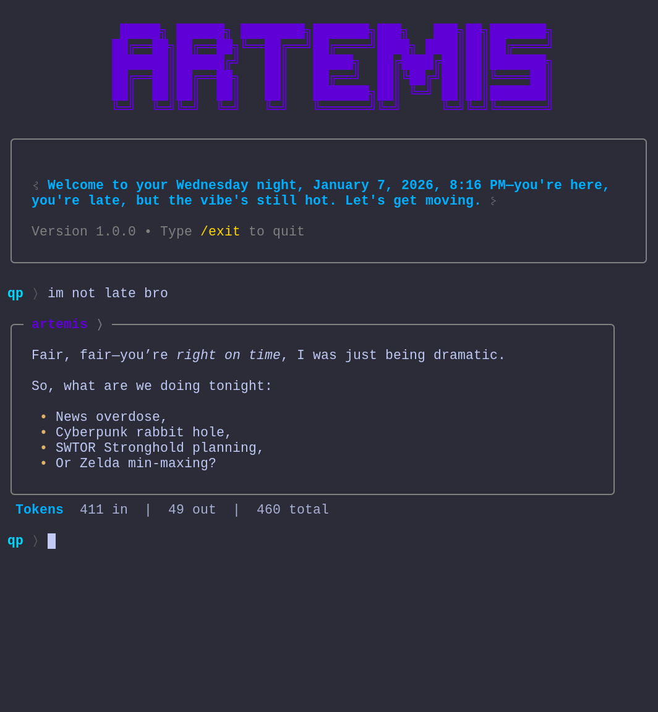

# Artemis

A multi-agent AI assistant built for the terminal. Each agent autonomously decides whether it has something useful to add to the conversation — no central dispatcher, no routing logic, no permission chains. Just parallel, independent agents enriching your context before the LLM ever sees it.

Runs in your terminal. Pairs well with tmux, tiling window managers (Hyprland, niri, Sway), and a cup of coffee at 2 AM.



## How It Works

Most AI assistant frameworks use a manager pattern: user input goes to a router, the router picks which tool or agent to invoke, results come back through the same bottleneck. Artemis doesn't do that.

When you send a message, **every agent sees it simultaneously**. Each one independently answers a single question: *"Can I add something useful here?"* Agents that say yes run in parallel. Their outputs get injected into the message context before the main LLM generates a response. Agents that say no cost almost nothing — a fast classification call at most.

```
You: "What's the current state of the Rust job market?"

                    ┌─ PersonalInfo ──── always runs, checks for extractable user info
                    ├─ LangDetect ────── always runs, detects language → "en"
 user input ───────►├─ OnlineSearch ──── LLM says yes → searches, fetches, extracts
                    ├─ URLReader ─────── no URLs found → skips
                    ├─ FileReader ────── no file paths → skips
                    └─ DailyNews ─────── no bang command → skips

                            │
                            ▼
              ┌──────────────────────────┐
              │  enriched context array  │
              │  [system + history +     │
              │   user msg + agent ctx]  │
              └──────────────────────────┘
                            │
                            ▼
                    main LLM response
```

The main LLM never knows agents exist. It just sees a well-structured message with rich context already baked in. This means you can swap the main model freely — agents are decoupled from the conversation model entirely.

### Context Engineering

The message array is carefully constructed:

1. **System prompt** — personality, formatting rules, current timestamp
2. **Conversation history** — rolling window, auto-trimmed to keep context manageable
3. **User message** — timestamped input with agent context appended

Agent outputs are formatted as labeled blocks and appended to the user message:

```
Agent context (use minimally for basic greetings, moderately for topical discussion, fully for complex queries):

[Online Research::
Title: Rust Developer Demand in 2026
URL: ...
Content: ...]

[Language Detection::
Your response/answer MUST use the language (ISO 639-1): en.]
```

The LLM gets a graduated instruction — use agent context proportionally to query complexity. A "hello" doesn't need three pages of search results. A research question does.

Importantly, agent context is **ephemeral** — it's injected into a temporary message array for the current request only. The enriched message is what the LLM sees, but only the raw user input (without agent context) gets persisted into conversation history. This means agent output enriches a single turn and then vanishes. The next turn gets fresh agent results based on the new input, and conversation history stays clean — no stale search results or outdated extractions accumulating in the context window.

## Installation

```bash
git clone https://github.com/yourusername/artemis.git
cd artemis
python -m venv .venv && source .venv/bin/activate
pip install -r requirements.txt
```

Set your API keys:

```bash
export OPENAI_API_KEY="..."        # or any provider litellm supports
export SERP_API_KEY="..."          # for web search (serper.dev)
export ENCKEY="..."                # encryption key for personal data
```

Run:

```bash
python cli.py
```

## Model Support

Artemis uses [litellm](https://github.com/BerriAI/litellm) under the hood, so it works with essentially any LLM provider — or your local models.

Configure in `_config.py`:

```python
# Main conversation model
llm = "openai/gpt-5.2"
# llm = "anthropic/claude-sonnet-4-5-20250929"
# llm = "ollama/llama3.1"
# llm = "ollama/gemma2:9b"

# Agent model (fast/cheap — used for classification and extraction)
agent_llm = "openai/gpt-5-mini"
# agent_llm = "ollama/phi4"
```

The two-tier model setup is intentional. Agents need speed, not depth — they're doing binary decisions ("search or not?"), keyword extraction, and language detection. The main model gets the full context and does the heavy lifting. Run agents on a local model and your main conversation on a cloud provider, or run everything local. Your call.

Reasoning effort is configurable per tier:

```python
ro = "medium"        # main model reasoning
agent_ro = "minimal" # agents: fast and cheap
```

## Agents

### Built-in

| Agent | Trigger | What it does |
|---|---|---|
| **PersonalInfo** | Always | Extracts personal info, encrypts and persists it locally. Builds a structured user profile with persistence levels (core/stable/situational/ephemeral) and automatic retention policies. |
| **LangDetect** | Always | Detects input language, instructs the main LLM to respond in kind. |
| **OnlineSearch** | LLM-decided | Generates search queries, fetches results via SERP API, extracts full page content with trafilatura. Smart depth: quick for simple lookups, thorough for research. |
| **URLReader** | URL in input | Fetches and extracts content from any URL you paste. |
| **FileReader** | File path in input | Reads files — text, PDF, DOCX, XLSX, and more via MarkItDown. Path traversal protection included. |
| **DailyNews** | `!news` `!games` `!finance` | Fetches from 50+ RSS feeds concurrently. |
| **HueLights** | LLM-decided | Controls Philips Hue lights via natural language. |

### Writing Your Own

Agents are simple. Inherit from `Agent`, implement two methods:

```python
from agents.Agent import Agent

class WeatherAgent(Agent):
    def should_process(self, user_input, last_response=None):
        # Return True if this agent should run.
        # This is called for EVERY message — keep it fast.
        return "weather" in user_input.lower()

    def process(self, user_input, last_response=None):
        # Do the actual work. Return a string to inject into context,
        # or None to contribute nothing.
        self.metadata = {"source": "weather-api"}
        return f"Current weather: 18°C, partly cloudy"
```

Register it in `core.py`:

```python
agent_configs = [
    # ... existing agents ...
    (WeatherAgent, "Weather"),
]
```

That's it. Your agent will be initialized on startup, called in parallel with every other agent, and its output will be injected into the LLM context if it returns something. No routing config, no tool schemas, no function calling plumbing.

Every agent gets:
- `self.llm` — an `LLMInterface` instance configured with the agent model
- `self.metadata` — dict that gets surfaced in the CLI sources panel
- `self.user` — current user identifier
- `Agent.get_executor()` — shared `ThreadPoolExecutor` (10 workers) for parallel I/O

## CLI Commands

| Command | Action |
|---|---|
| `/exit` | Quit |
| `/save [name]` | Save last exchange to markdown file |
| `/cost` | Show session cost breakdown per context (main + each agent) |

## Project Structure

```
artemis/
├── cli.py                  # terminal interface
├── core.py                 # orchestrator — agent lifecycle, context assembly, streaming
├── _config.py              # all configuration in one place
├── llms/
│   └── LLMInterface.py     # litellm wrapper, cost tracking, reasoning model support
├── agents/
│   ├── Agent.py            # base class
│   ├── OnlineSearch.py     # web search + content extraction
│   ├── PersonalInfo.py     # encrypted user memory
│   ├── ReadURLs.py         # URL content fetcher
│   ├── FileReader.py       # file reader (text, pdf, docx, ...)
│   ├── News.py             # RSS aggregator
│   ├── HueLights.py        # smart home control
│   └── LangDetect.py       # language detection
├── tools/
│   ├── utils.py            # shared utilities, encryption, web extraction
│   └── readpinf.py         # memory viewer/debugger
└── requirements.txt
```

## Data Storage

All persistent data lives in `~/.artemis/`:

| File | Contents |
|---|---|
| `.pinf` | Encrypted personal memory store (Fernet/AES-128-CBC) |
| `.artemis_history` | CLI command history |
| `artemis_*.md` | Saved chat exports (`/save` command) |

If a `data/` directory exists in the project root, that takes priority — useful for development or keeping data local to the repo.

## Privacy

Personal information is encrypted at rest using Fernet with a key derived from your `ENCKEY` environment variable via PBKDF2. No cloud sync, no telemetry, no third-party access. Inspect your stored memories anytime:

```bash
python tools/readpinf.py --stats
python tools/readpinf.py --list
python tools/readpinf.py --search "python"
```

## License

MIT
